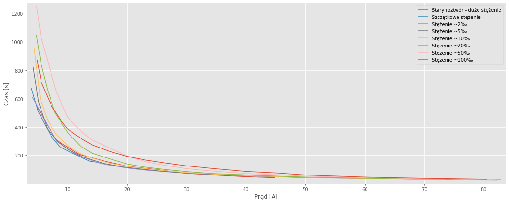
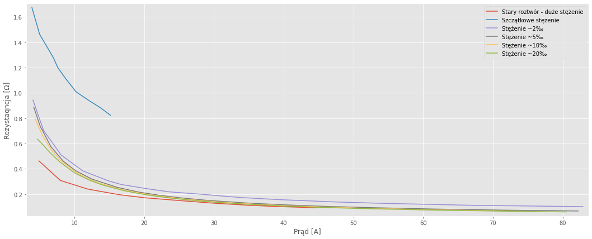

# Elektrolizer - Pomiary statyczne + RLC

### Stary roztwór KOH (nieznzne stężenie) 07.09.2020

**Pomiary mostkiem RLC**

| Freq[kHz] |  Z[Ω] | Fi[°] | Ls[uH] | ESR[Ω] |
| --------: | ----: | ----: | -----: | -----: |
|       0.1 | 0.030 | -56.3 |  -39.6 | 0.0166 |
|         1 | 0.032 |  64.6 |   4.66 | 0.0138 |
|        10 | 0.313 | 85.90 |   4.97 | 0.0701 |
|       100 | 3.023 | 88.67 |   4.81 |  0.119 |
|       200 |  5.98 | 88.86 |  4.764 |   0.12 |

**Pomiary statyczne**

|  I[A] | U[V] | Time |  R[Ω] |
| ----: | ---: | ---: | ----: |
|   4.9 | 2.27 | 8:57 | 0.463 |
|  7.97 | 2.46 | 5:10 | 0.309 |
|  11.9 | 2.86 | 3:27 |  0.24 |
| 16.46 | 3.22 | 2:36 | 0.196 |
| 20.15 | 3.45 |  2:2 | 0.171 |
| 25.03 | 3.75 | 1:39 |  0.15 |
| 29.96 | 3.86 | 1:13 | 0.129 |
| 35.03 | 3.93 |  1:0 | 0.112 |
| 39.58 | 4.02 | 0:50 | 0.102 |
| 44.79 | 4.15 | 0:42 | 0.093 |

### Woda destylowana (szczątkowe stężenie)

**Pomiary mostkiem RLC**

| Freq[kHz] | Z[Ω] | Fi[°]  | Ls[uH] | ESR[Ω] | Cp[uF] | D[-]  |
| :-------: | :--: | :----: | :----: | :----: | :----: | :---: |
|    0.1    | 0.69 | -4.821 |  -94   |  0.69  | 192.5  | 11.85 |
|     1     | 0.68 | 1.688  |  3.22  |  0.69  |  -6.9  | 33.97 |
|    10     | 0.76 | 20.45  |  4.2   |  0.71  | -7.28  | 2.69  |
|    100    | 2.51 | 39.91  |  2.56  |  1.92  | -0.407 | 1.194 |
|    200    | 3.4  | 26.64  | 1.217  |  3.05  | -0.105 | 1.991 |

**Pomiary statyczne**

|  I[A] |  U[V] |  Time |  R[Ω] |
| ----: | ----: | ----: | ----: |
|   3.9 |  6.53 | 11:10 | 1.674 |
|  5.01 |  7.33 | 08:30 | 1.463 |
| 6.979 | 8.919 | 05:52 | 1.278 |
| 7.599 | 9.129 | 05:11 | 1.201 |
| 8.679 | 9.699 | 04:20 | 1.118 |
| 10.23 | 10.32 | 03:46 | 1.009 |
| 12.13 | 11.38 | 03:09 | 0.938 |
|  13.7 | 12.11 | 02:38 | 0.884 |
| 15.16 | 12.49 | 02:31 | 0.824 |

W kolejnym pomiarze zostało odmierzone 20g KOH i zostało

### Roztwór KOH ~2‰

| Freq[kHz] | Z[Ω]  | Fi[°]  | Ls[uH] | ESR[Ω] | Cp[uF] | D[-] |
| :-------: | :---: | :----: | :----: | :----: | :----: | :--: |
|    0.1    | 0.121 | -10.44 |   -    |   -    |   -    |  -   |
|     1     | 0.121 | -10.44 |   -    |   -    |   -    |  -   |
|    10     | 0.313 | 80.57  |   -    |   -    |   -    |  -   |
|    100    |   -   |   -    |   -    |   -    |   -    |  -   |
|    200    | 5.842 | 88.65  |   -    |   -    |   -    |  -   |

|  I[A] | U[V] |  Time |  R[Ω] |
| ----: | ---: | ----: | ----: |
|  4.05 | 3.82 | 10:10 | 0.943 |
|  5.57 | 3.92 | 08:12 | 0.704 |
|  8.08 | 4.12 | 05:00 |  0.51 |
| 11.19 |  4.3 | 03:32 | 0.384 |
| 14.83 | 4.54 | 02:30 | 0.306 |
|  16.7 | 4.62 | 02:13 | 0.277 |
| 20.46 | 4.97 | 01:48 | 0.243 |
| 23.52 | 5.15 | 01:34 | 0.219 |
| 28.73 | 5.66 | 01:17 | 0.197 |
| 33.76 | 5.87 | 01:06 | 0.174 |
| 39.47 | 6.18 | 00:56 | 0.157 |
|  47.5 | 6.58 | 00:46 | 0.139 |
|  54.5 | 6.93 | 00:42 | 0.127 |
|  67.3 | 7.53 | 00:33 | 0.112 |
|  82.9 | 8.44 | 00:27 | 0.102 |

**Rodzina charakterystyk czasu osiągnięcia ciśnienia 0,2 Bara w funkcji napięcia**. Czas osiągnięcia ciśnienia jest powiązany z ilością wyprodukowanego wodoru i tlenu.

Widać, że stężenie nie ma wpływu na tę zależność — po prostu wraz ze zwiększaniem prądu przepływającego przez elektrolizer zwiększa się ilość wyprodukowanego wodoru.

**Rodzina charakterystyk rezystancji elektrolizera w funkcji napięcia**

Widzimy, że dla większych prądów elektrolizer posiada mniejszą rezystancję. Może to oznaczać, że bardziej wydajnie pracuje się na nim z wyższymi prądami. Obserwujemy też, że przy większym stężeniu rezystancja jest mniejsza.

## Spostrzerzenia

- Podczas zmiany punktu pracy prąd spada, a napięcie rośnie, co oznacza, że rezystancja elektrolizera również się zmienia.
- Ciekawą obserwacją jest, że podczas zwalniania zaworu prąd znacznie rośnie, a potem powoli spada. Może wyższe ciśnienie prowadzi, do zwiększenia rezystancji elektrolizera zmniejszając produkcję. Jednak podczas pomiaru przepływomierzem (bez zmiany ciśnienia) można było zaobserwować wahania przy zmianie punktu pracy. Tą zależność będzie można wyłapać za pomocą pomiarów rejestrowanych automatycznie w czasie rzeczywistym.

Dalej nie ma pomiarów, bo mostek się zacina — nie wiem do końca, z czego to wynika, ale jak trochę rozładowałem elektrolizer, to zaczął działać, ale tylko przez chwilę — i nie chciałem zmieniać stężenia roztowru, zanim będzie pewien pomiarów mostekm.
