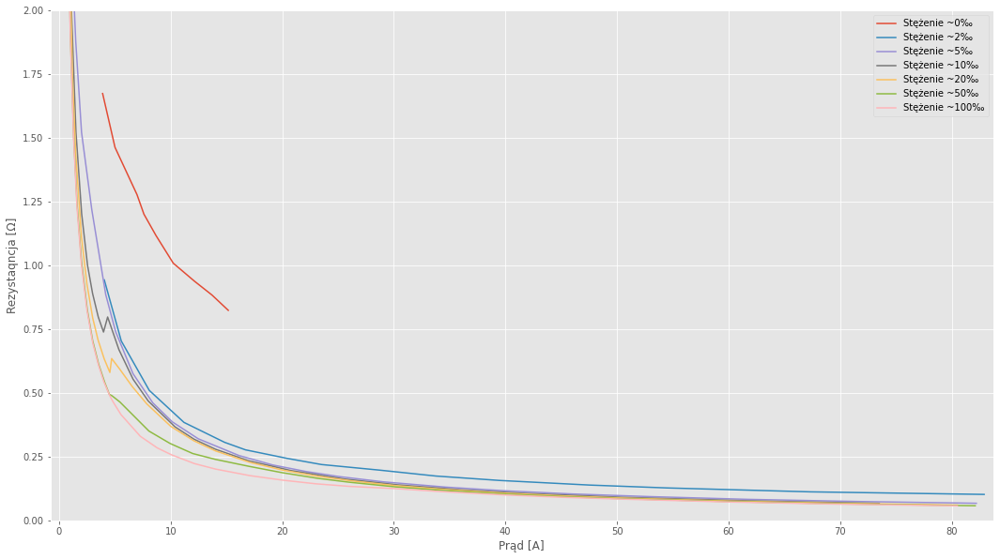
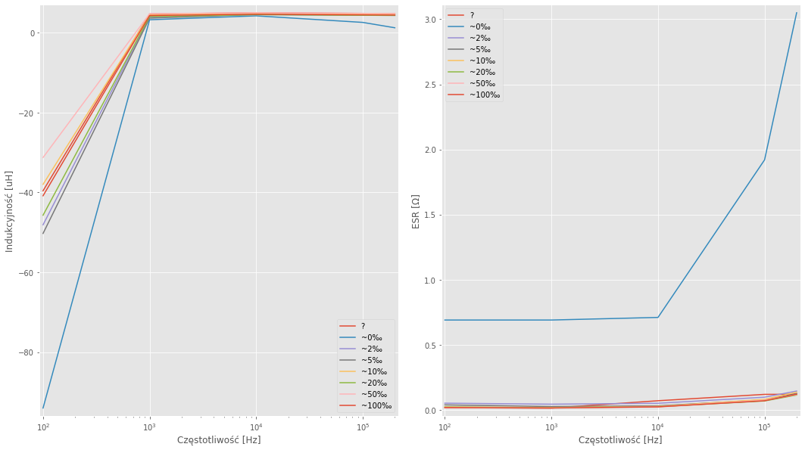

# Elektrolizer - Static + RLC

[Notobook python](./jupyter/eclz-static-rlc.ipynb)

## Charakterystyki stężenia

**Rodzina charakterystyk napięcia w funkcji stężenia**

**Rodzina charakterystyk czasu osiągnięcia ciśnienia 0,2 Bara w funkcji stężenia**

Wydaje się, że najlepszy rezultat osiągamy przy stężeniu **1%**, ale wtedy mamy znacznie większe napięcie. Wydaje mi się, że KOH jest na tyle mocną zasadą, że nawet przy małych stężeniach elektroliza przebiega wydajnie. Możliwe, że dla znacznie większych prądów brakowałoby nośników.

## Charakterystyki statyczne

**Rodzina charakterystyk czasu osiągnięcia ciśnienia 0,2 Bara w funkcji napięcia**. Czas osiągnięcia ciśnienia jest powiązany z ilością wyprodukowanego wodoru i tlenu.

Zwężenie zakresu dla dużych prądów

**Rodzina charakterystyk rezystancji elektrolizera w funkcji napięcia**

Widzimy, że dla większych prądów elektrolizer posiada mniejszą rezystancję. Może to oznaczać, że bardziej wydajnie pracuje się na nim z wyższymi prądami. Obserwujemy też, że przy większym stężeniu rezystancja jest mniejsza.

**Rodzina charakterystyk prądowo-napięciowych elektrolizera w funkcji napięcia**

Skok koło **5V** jest spowodowany rozpoczęciem pomiarów czasu i znacznie dużym czasem pracy elektrolizera. Podczas pracy Charakterystyka elektrolizera się zmienia.

## Charakterystyki RLC

**Rodzina charakterystyk modułu impedancji (lewo) oraz jej fazy (prawo) elektrolizera w funkcji częstotliwości**

W przypadku większego stężenia KOH zmiana charakteru elektrolizera z Pojemnościowego na Indukcyjny przebiega gwałtowniej.

**Rodzina charakterystyk indukcyjności (lewo) oraz rezystancji szeregowej (prawo) elektrolizera w funkcji częstotliwości**

Wraz z wzrostem stężenia KOH zwiększa się indukcyjność elektrolizera

## Spostrzerzenia

- Podczas zmiany punktu pracy prąd spada, a napięcie rośnie, co oznacza, że rezystancja elektrolizera również się zmienia.
- Ciekawą obserwacją jest, że podczas zwalniania zaworu prąd znacznie rośnie, a potem powoli spada. Może wyższe ciśnienie prowadzi, do zwiększenia rezystancji elektrolizera zmniejszając produkcję. Jednak podczas pomiaru przepływomierzem (bez zmiany ciśnienia) można było zaobserwować wahania przy zmianie punktu pracy. Tą zależność będzie można wyłapać za pomocą pomiarów rejestrowanych automatycznie w czasie rzeczywistym.

Dalej nie ma pomiarów, bo mostek się zacina — nie wiem do końca, z czego to wynika, ale jak trochę rozładowałem elektrolizer, to zaczął działać, ale tylko przez chwilę — i nie chciałem zmieniać stężenia roztowru, zanim będzie pewien pomiarów mostekm.

## Pomiary

### Stary roztwór KOH (nieznzne stężenie) 07.09.2020

**Pomiary mostkiem RLC**

| Freq[kHz] |  Z[Ω] | Fi[°] | Ls[uH] | ESR[Ω] |
| --------: | ----: | ----: | -----: | -----: |
|       0.1 | 0.030 | -56.3 |  -39.6 | 0.0166 |
|         1 | 0.032 |  64.6 |   4.66 | 0.0138 |
|        10 | 0.313 | 85.90 |   4.97 | 0.0701 |
|       100 | 3.023 | 88.67 |   4.81 |  0.119 |
|       200 |  5.98 | 88.86 |  4.764 |   0.12 |

**Pomiary statyczne**

|  I[A] | U[V] |  Time |  R[Ω] |
| ----: | ---: | ----: | ----: |
|   4.9 | 2.27 | 08:57 | 0.463 |
|  7.97 | 2.46 | 05:10 | 0.309 |
|  11.9 | 2.86 | 03:27 |  0.24 |
| 16.46 | 3.22 | 02:36 | 0.196 |
| 20.15 | 3.45 | 02:02 | 0.171 |
| 25.03 | 3.75 | 01:39 |  0.15 |
| 29.96 | 3.86 | 01:13 | 0.129 |
| 35.03 | 3.93 |  01:0 | 0.112 |
| 39.58 | 4.02 | 00:50 | 0.102 |
| 44.79 | 4.15 | 00:42 | 0.093 |

### Woda destylowana (szczątkowe stężenie)

**Pomiary mostkiem RLC**

| Freq[kHz] | Z[Ω] |  Fi[°] | Ls[uH] | ESR[Ω] | Cp[uF] |  D[-] |
| --------: | ---: | -----: | -----: | -----: | -----: | ----: |
|       0.1 | 0.69 | -4.821 |    -94 |   0.69 |  192.5 | 11.85 |
|         1 | 0.68 |  1.688 |   3.22 |   0.69 |   -6.9 | 33.97 |
|        10 | 0.76 |  20.45 |    4.2 |   0.71 |  -7.28 |  2.69 |
|       100 | 2.51 |  39.91 |   2.56 |   1.92 | -0.407 | 1.194 |
|       200 |  3.4 |  26.64 |  1.217 |   3.05 | -0.105 | 1.991 |

**Pomiary statyczne**

|  I[A] |  U[V] |  Time |  R[Ω] |
| ----: | ----: | ----: | ----: |
|   3.9 |  6.53 | 11:10 | 1.674 |
|  5.01 |  7.33 | 08:30 | 1.463 |
| 6.979 | 8.919 | 05:52 | 1.278 |
| 7.599 | 9.129 | 05:11 | 1.201 |
| 8.679 | 9.699 | 04:20 | 1.118 |
| 10.23 | 10.32 | 03:46 | 1.009 |
| 12.13 | 11.38 | 03:09 | 0.938 |
|  13.7 | 12.11 | 02:38 | 0.884 |
| 15.16 | 12.49 | 02:31 | 0.824 |

W kolejnym pomiarze zostało odmierzone 20g KOH i zostało

### Roztwór KOH ~2‰

**Pomiary mostkiem RLC**

| Freq[kHz] |  Z[Ω] |  Fi[°] | Ls[uH] | ESR[Ω] | Cp[uF] |  D[-] |
| --------: | ----: | -----: | -----: | -----: | -----: | ----: |
|       0.1 | 0.121 | -10.44 | -48.12 | 0.0512 |  13660 | 1.678 |
|         1 | 0.050 |  29.93 |  3.946 | 0.0437 |  -1562 | 1.767 |
|        10 | 0.287 |  79.99 |    4.5 | 0.0506 | -54.52 | 0.179 |
|       100 | 2.736 |  87.96 |  4.352 | 0.0973 | -0.581 | 0.035 |
|       200 | 5.491 |  88.49 |  4.308 | 0.1446 | -0.147 | 0.026 |

**Pomiary statyczne**

|  I[A] | U[V] |  Time |  R[Ω] |
| ----: | ---: | ----: | ----: |
|  4.05 | 3.82 | 10:10 | 0.943 |
|  5.57 | 3.92 | 08:12 | 0.704 |
|  8.08 | 4.12 | 05:00 |  0.51 |
| 11.19 |  4.3 | 03:32 | 0.384 |
| 14.83 | 4.54 | 02:30 | 0.306 |
|  16.7 | 4.62 | 02:13 | 0.277 |
| 20.46 | 4.97 | 01:48 | 0.243 |
| 23.52 | 5.15 | 01:34 | 0.219 |
| 28.73 | 5.66 | 01:17 | 0.197 |
| 33.76 | 5.87 | 01:06 | 0.174 |
| 39.47 | 6.18 | 00:56 | 0.157 |
|  47.5 | 6.58 | 00:46 | 0.139 |
|  54.5 | 6.93 | 00:42 | 0.127 |
|  67.3 | 7.53 | 00:33 | 0.112 |
|  82.9 | 8.44 | 00:27 | 0.102 |

### Roztwór KOH ~5‰

**Pomiary mostkiem RLC**

| Freq[kHz] |  Z[Ω] |  Fi[°] | Ls[uH] | ESR[Ω] | Cp[uF] |  D[-] |
| --------: | ----: | -----: | -----: | -----: | -----: | ----: |
|       0.1 | 0.049 | -40.01 | -50.28 | 0.0382 |  20440 | 1.204 |
|         1 | 0.034 |  41.91 |  3.628 | 0.0254 |  -3115 | 1.116 |
|        10 | 0.287 |  83.83 |  4.559 | 0.0309 | -54.93 | 0.108 |
|       100 | 2.773 |  88.39 |  4.411 |  0.077 | -0.574 | 0.028 |
|       200 | 5.489 |  88.69 |  4.365 |  0.126 | -0.145 | 0.023 |

**Pomiary statyczne**

|  I[A] | U[V] |  Time |
| ----: | ---: | ----: |
|  0.08 | 1.83 |     - |
|  0.13 | 1.88 |     - |
|  0.20 | 1.96 |     - |
|  0.30 | 2.04 |     - |
|  0.50 | 2.21 |     - |
|  0.70 | 2.36 |     - |
|  0.90 | 2.49 |     - |
|  1.14 | 2.54 |     - |
|  1.49 |  2.8 |     - |
|  2.01 | 3.06 |     - |
|  2.93 | 3.57 |     - |
|  4.18 | 3.70 | 13:42 |
|  5.07 | 3.75 | 09.35 |
|  6.62 | 3.81 | 06:22 |
|  8.40 | 3.87 | 04:52 |
| 10.15 | 3.92 | 04:00 |
| 12.47 | 3.99 | 03:09 |
| 16.13 | 4.10 | 02:22 |
| 19.15 | 4.16 | 01:59 |
| 22.14 | 4.24 | 01:44 |
| 25.09 | 4.31 | 01:31 |
| 29.09 | 4.39 | 01:17 |
| 34.68 | 4.52 | 01:05 |
| 39.83 | 4.63 | 00:56 |
| 45.80 | 4.76 | 00:48 |
| 52.90 | 4.93 | 00:41 |
| 61.80 | 5.09 | 00:36 |
| 71.70 | 5.30 | 00:30 |
| 82.20 | 5.51 | 00:26 |

### Roztwór KOH ~10‰

**Pomiary mostkiem RLC**

| Freq[kHz] |  Z[Ω] |  Fi[°] | Ls[uH] | ESR[Ω] | Cp[uF] |   D[-] |
| --------: | ----: | -----: | -----: | -----: | -----: | -----: |
|       0.1 | 0.032 | -46.74 | -37.99 | 0.0223 |  35160 |  0.944 |
|         1 | 0.033 |  57.12 |  4.493 | 0.0181 |   3994 |  0.643 |
|        10 | 0.305 |  85.01 |  4.842 | 0.0265 | -51.93 |  0.087 |
|       100 | 2.933 |  88.41 |  4.666 | 0.0806 | -0.542 | 0.0275 |
|       200 | 5.800 |  88.67 |  4.615 | 0.1356 | -0.137 | 0.0232 |

**Pomiary statyczne**

|  I[A] | U[V] |  Time |
| ----: | ---: | ----: |
|  0.07 | 1.70 |     - |
|  0.10 | 1.77 |     - |
|  0.15 | 1.82 |     - |
|  0.20 | 1.85 |     - |
|  0.30 | 1.91 |     - |
|  0.50 | 1.98 |     - |
|  1.00 | 2.13 |     - |
|  1.51 | 2.30 |     - |
|  2.02 | 2.43 |     - |
|  2.55 | 2.55 |     - |
|  3.00 | 2.67 |     - |
|  3.51 | 2.80 |     - |
|  3.98 | 2.94 |     - |
|  4.35 | 3.47 | 15:54 |
|  5.36 | 3.59 | 09:59 |
|  6.63 | 3.67 | 07:26 |
|  7.99 | 3.74 | 05:48 |
| 10.38 | 3.81 | 04:15 |
| 12.09 | 3.85 | 03:32 |
| 14.02 | 3.91 | 03:02 |
| 17.00 | 3.97 | 02:25 |
| 20.79 | 4.06 | 01:57 |
| 25.60 | 4.15 | 01:34 |
| 30.30 | 4.23 | 01:17 |
| 36.09 | 4.33 | 01:04 |
| 41.60 | 4.42 | 00:54 |
| 50.50 | 4.57 | 00:44 |
|  61.7 | 4.74 | 00:36 |
|  73.5 | 4.90 | 00:28 |

### Roztwór KOH ~20‰

**Pomiary mostkiem RLC**

| Freq[kHz] |  Z[Ω] |  Fi[°] | Ls[uH] | ESR[Ω] |  Cp[uF] |   D[-] |
| --------: | ----: | -----: | -----: | -----: | ------: | -----: |
|       0.1 | 0.030 | -54.87 | -45.72 | 0.0216 |   35325 | 0.7399 |
|         1 | 0.030 |  56.99 |  4.032 | 0.0165 |   -4417 | 0.6531 |
|        10 | 0.284 |  85.13 |  4.495 | 0.0245 |  -55.87 | 0.0855 |
|       100 | 2.734 |  88.55 |  4.345 | 0.0684 | -0.5826 | 0.0249 |
|       200 | 5.413 |  88.79 |  4.306 | 0.1139 | -0.1471 | 0.0210 |

**Pomiary statyczne**

|  I[A] |  U[V] |  Time |
| ----: | ----: | ----: |
|  0.07 |  1.33 |     - |
|  0.10 |  1.41 |     - |
|  0.15 |  1.48 |     - |
|  0.21 |  1.55 |     - |
|  0.31 |  1.66 |     - |
|  0.50 |  1.88 |     - |
|  0.76 |  1.99 |     - |
|  1.20 |  2.09 |     - |
|  1.49 |  2.14 |     - |
|  2.00 |  2.23 |     - |
|  2.49 |  2.31 |     - |
|  3.01 |  2.39 |     - |
|  3.49 |  2.47 |     - |
|  4.04 |  2.56 |     - |
|  4.55 |  2.64 |     - |
|  4.71 |  2.68 | 17:28 |
|  5.46 |  3.23 | 14:12 |
|  6.55 |  3.44 | 11:07 |
|  7.85 |  3.59 | 08:19 |
| 10.01 |  3.69 | 05:58 |
| 12.07 |  3.77 | 04:27 |
| 14.03 |  3.82 | 03:36 |
| 17.13 |  3.89 | 02:54 |
| 20.08 |  3.95 | 02:18 |
| 23.15 |  4.01 | 01:56 |
| 26.19 |  4.06 | 01:41 |
| 30.09 |  4.11 | 01:25 |
| 34.11 |  4.18 | 01:12 |
| 39.85 |  4.26 | 01:02 |
|  45.2 |  4.34 | 00:53 |
|  50.3 | 4.415 | 00:46 |
|  60.2 |  4.55 | 00:38 |
|  69.9 |  4.69 | 00:33 |
|  80.5 |  4.83 | 00:28 |

### Roztwór KOH ~50‰

**Pomiary mostkiem RLC**

| Freq[kHz] |  Z[Ω] |  Fi[°] | Ls[uH] | ESR[Ω] |  Cp[uF] |    D[-] |
| --------: | ----: | -----: | -----: | -----: | ------: | ------: |
|       0.1 | 0.026 | -47.89 | -31.27 | 0.0177 |   44960 |  0.8981 |
|         1 | 0.033 |  63.95 |  4.738 | 0.0145 |   -4308 |   0.488 |
|        10 | 0.313 |  85.71 |  4.976 | 0.0234 |  -50.54 |  0.0748 |
|       100 | 3.026 |  88.58 |  4.815 | 0.0745 | -0.5256 | 0.02455 |
|       200 | 5.993 |  88.88 |  4.767 | 0.1173 | -0.1328 |  0.0194 |

**Pomiary mostkiem RLC - dla 5 dniowej przerwy w pracy**

Tuż po pracy mostek nie jest w stanie zebrać pomiarów.
Gdy elektrolizer zbyt długo nie pracuje pomiary pływają i nie wskazują na żadną zależność.

| Freq[kHz] |  Z[Ω] |  Fi[°] | Ls[uH] | ESR[Ω] |  Cp[uF] |  D[-] |
| --------: | ----: | -----: | -----: | -----: | ------: | ----: |
|       0.1 | 0.124 | -11,29 | -39.05 |  0.122 |    2513 | 4.974 |
|         1 | 0.123 |   14.1 |   4.76 |  0.119 |  -315.8 | 3.982 |
|        10 | 0.355 |  60.51 |  4.928 |  0.175 |  -38.90 | 0.566 |
|       100 | 2.988 |  19.14 |  1.553 |  2.828 | -0.1734 | 2.899 |
|       200 | 5.639 | -18.64 | -1.442 |  5.352 |  0.0452 | 2.945 |

**Pomiary statyczne**

|  I[A] |  U[V] |  Time |
| ----: | ----: | ----: |
|  0.04 |  1.37 |     - |
|  0.10 |  1.44 |     - |
|  0.16 |  1.51 |     - |
|  0.20 |  1.56 |     - |
|  0.30 |  1.69 |     - |
|  0.50 |  1.82 |     - |
|  0.75 |  1.89 |     - |
|  1.01 |  1.93 |     - |
|  1.31 |  1.97 |     - |
|  1.61 |  2.00 |     - |
|  2.00 |  2.04 |     - |
|  2.52 | 2.085 |     - |
|  3.01 |  2.12 |     - |
|  3.54 |  2.17 |     - |
|  4.07 |  2.21 |     - |
|  4.50 | 2.225 |     - |
|  4.75 |  2.32 | 20:50 |
|  5.45 |  2.53 | 17:20 |
|  8.05 |  2.82 | 10:49 |
|  9.95 |  3.00 | 07:51 |
| 11.98 |  3.14 | 06:17 |
| 14.00 |  3.35 | 05:10 |
| 16.99 | 3.605 | 04:13 |
| 20.02 |  3.74 | 03:15 |
| 23.18 |  3.82 | 02:34 |
| 25.99 |  3.89 | 02:11 |
| 30.19 |  3.96 | 01:45 |
| 34.07 |  4.04 | 01:30 |
|  40.1 |  4.13 | 01:11 |
|  45.2 |  4.20 | 01:03 |
|  50.0 |  4.28 | 00:53 |
|  60.3 |  4.42 | 00:42 |
|  70.0 |  4.54 | 00:35 |
|  82.1 |  4.70 | 00:28 |

### Roztwór KOH ~100‰

**Pomiary mostkiem RLC**

| Freq[kHz] |  Z[Ω] |  Fi[°] | Ls[uH] | ESR[Ω] |  Cp[uF] |   D[-] |
| --------: | ----: | -----: | -----: | -----: | ------: | -----: |
|       0.1 | 0.031 | -55.55 | -40.85 | 0.0176 |   41910 |  0.685 |
|         1 | 0.030 |  61.95 |  4.285 | 0.0143 |   -4577 |  0.535 |
|        10 | 0.291 |  85.46 |  4.615 | 0.0229 |  -54.51 | 0.0791 |
|       100 | 2.798 |  88.56 |  4.453 | 0.0699 | -0.5685 |  0.025 |
|       200 | 5.539 |  88.75 |  4.406 | 0.1204 | -0.1426 | 0.0216 |

**Pomiary statyczne**

Całkiem ładnie widać, że nasz wykres powoli zbliża się do pomiarów z września.

|  I[A] | U[V] |  Time |
| ----: | ---: | ----: |
|  0.05 | 1.43 |     - |
|  0.10 | 1.47 |     - |
|  0.15 | 1.52 |     - |
|  0.20 | 1.58 |     - |
|  0.30 | 1.70 |     - |
|  0.50 | 1.82 |     - |
|  0.75 | 1.87 |     - |
|  1.01 | 1.91 |     - |
|  1.30 | 1.95 |     - |
|  1.60 | 1.97 |     - |
|  2.00 | 2.01 |     - |
|  2.50 | 2.06 |     - |
|  3.02 | 2.10 |     - |
|  3.53 | 2.15 |     - |
|   4.0 | 2.18 |     - |
|  4.54 | 2.22 |     - |
|  4.85 | 2.25 | 14:30 |
|  5.54 | 2.30 | 11:54 |
|  7.28 | 2.40 | 09:06 |
|  8.80 | 2.50 | 07:28 |
| 10.07 | 2.59 | 06:21 |
| 12.12 | 2.70 | 05:21 |
| 14.02 | 2.82 | 04:35 |
| 17.10 | 3.00 | 03:47 |
| 20.05 | 3.16 | 03:12 |
| 23.01 | 3.30 | 02:47 |
| 26.04 | 3.47 | 02:28 |
| 30.10 | 3.75 | 02:05 |
| 34.16 | 3.86 | 01:48 |
|  40.1 | 3.98 | 01:26 |
|  45.4 | 4.09 | 01:15 |
|  50.4 | 4.20 | 01:00 |
|  60.3 | 4.33 | 00:46 |
|  69.7 | 4.44 | 00:38 |
|  80.5 | 4.59 | 00:31 |
