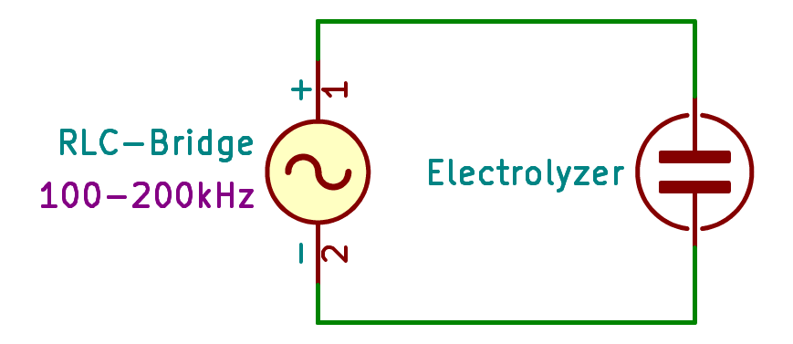
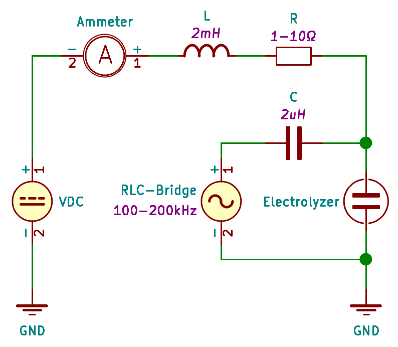

## UMG - Emilian Świtalski

- [Chart Example](http://www.sqrt.pl/view/?https://raw.githubusercontent.com/Xaeian/umg/master/measurement/example.json)
- [Data CSV Example](./measurement/example.csv)

---

# Elektrolizer

#

Schemat do pomiaru charakteru (**L** oraz **C** w funkcji **f**) przy pomocy mostka RLC:

Wyniki pomiarów: [electrolyzer-rlc.csv](./measurement/electrolyzer-rlc.csv)

Schemat do pomiaru charakteru (**L** oraz **C** w funkcji **f**) ze stałą składową przy pomocy mostka RLC:
,

Render 3D:

Pomiary - mostek RLC
