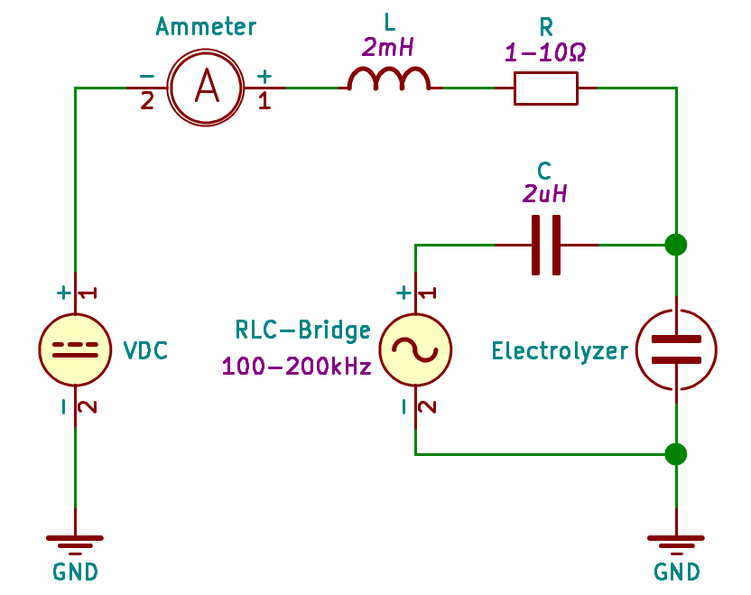

## UMG - Emilian Świtalski

- [Chart Example](http://www.sqrt.pl/view/?https://raw.githubusercontent.com/Xaeian/umg/master/measurement/example.json)
- [Data CSV Example](./measurement/example.csv)

# Elektrolizer

#### Zasilacz PWM

Zasilacz PCB - Render 3D:

#### Pomiary mostkiem RLC

Schemat do pomiaru charakteru (**L** oraz **C** w funkcji **f**) przy pomocy mostka RLC:

Wyniki pomiarów: [electrolyzer-rlc.csv](./measurement/electrolyzer-rlc.csv)

#### Pomiary mostkiem RLC ze składowąstałą

Schemat do pomiaru charakteru (**L** oraz **C** w funkcji **f**) ze składową stałą przy pomocy mostka RLC:

