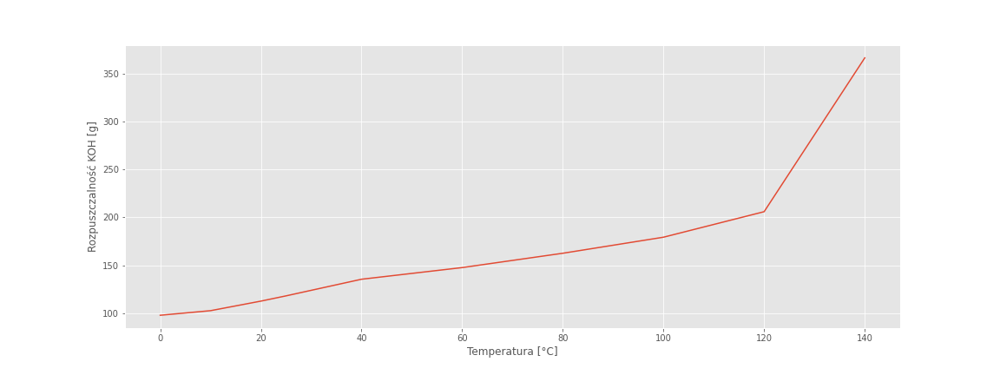

## UMG - Emilian Świtalski

- Data Example [↪](./measurement/example.csv)
- Wykres Example [↪](http://www.sqrt.pl/view/?https://raw.githubusercontent.com/Xaeian/umg/master/measurement/example.json)

# Elektrolizer PH

#### Pomiar PH za pomocą sądy

Pomiar pH został zrealizowany za pomocą sondy przemysłowej [H-101 pH electrode](https://wiki.dfrobot.com/Industrial_pH_electrode_SKU_FIT0348_) oraz przetwornika (układu wzmacniającego) [DF-Robot PH-meter](https://wiki.dfrobot.com/PH_meter_SKU__SEN0161_). Na wyjściu przetwornika uzyskujemy sygnał w zakresie od GND `0V` do napięcia zasilana `3.3V`. Zależność między **pH** roztworu, a **napięciem [V]** powinna być liniowa. Do kalibracji sondy używamy trzech roztworów buforowych:

- cytrynianowy ph = **4.00** ±0.03
- fosforanowy ph = **7.00** ±0.03
- boranowy ph = **9.00** ±0.03

|         Sonda pH          |          Roztwory          |
| :-----------------------: | :------------------------: |
|  |  |

, Jednak lepiej wykorzystać wszystkie, gdyż w przypadku delikatnej nieliniowości zostanie ona skompensowana. Przetwornik **ADC** jest skalibrowany na 16-bitów. Kalibracja polega na wykonaniu 3 pomiarów. Każdy z pomiarów dostarczy nam informacji wynik konwersji A/C _(oś **x**)_. Następnie trzeba skojarzyć pomiary z znanymi wartościami pH _(oś **y**)_. Mając 3 punkty (**x**, **y**) możemy obliczyć parabole, która będzie funkcją **pH** od wartość cyfrowej przetwornika **ADC**.

W praktycznej implementacji mamy obiekt kalibracji, który przechowuje:

- punkty kalibracyjne `float x[2]`,`float y[2]`
- współczynniki paraboli `float a`,`float b`,`float c`
- kontroler emulatora pamięci eeprom `EEPROM_t *eeprom`
- flagę zapisu `uint8_t save`

```cpp
typedef struct
{
  const char *name;
  EEPROM_t *eeprom;
  float a;
  float b;
  float c;
  float x[2];
  float y[2];
  uint8_t save;
}
QUAD_t;
```

Podczas kalibracji trzeba 3 razy (dla każdego z punktów kalibracyjnych) wywołać funkcję `QUAD_Point`:

```cpp
void QUAD_Point(QUAD_t *scale, float x, float y)
{
  #if(SCALE_DBG)
    DBG_String("QUAD x:\0"); DBG_Float(x, 3);
    DBG_String(" y:\0"); DBG_Float(y, 3);
    DBG_Enter();
  #endif

  if(scale->save == 2)
  {
    double x0 = (double)scale->x[0];
    double x1 = (double)scale->x[1];
    double x2 = (double)x;

    double y0 = (double)scale->y[0];
    double y1 = (double)scale->y[1];
    double y2 = (double)y;

    double n0 = (x0 * x0) - (x1 * x1);
    double n1 = (x0 * x1 * x1) - (x1 * x0 * x0);
    double n2 = (y1 * x0 * x0) - (y0 * x1 * x1);

    double m0 = (x1 * x1) - (x2 * x2);
    double m1 = (x1 * x2 * x2) - (x2 * x1 * x1);
    double m2 = (y2 * x1 * x1) - (y1 * x2 * x2);

    scale->b = (float)(((n0 * m2) - (n2 * m0)) / ((n1 * m0) - (m1 * n0)));
    scale->c = (float)(((double)scale->b * n1) + n2) / n0;
    scale->a = (float)(y0 - (double)scale->c - ((double)scale->b * x0)) / (x0 * x0);

    EEPROM_Write(scale->eeprom, (uint32_t *)&scale->a);
    EEPROM_Write(scale->eeprom, (uint32_t *)&scale->b);
    EEPROM_Write(scale->eeprom, (uint32_t *)&scale->c);

    #if(SCALE_DBG)
      DBG_String("QUAD a:\0"); DBG_Float(scale->a, 4);
      DBG_String(" b:\0"); DBG_Float(scale->b, 4);
      DBG_String(" c:\0"); DBG_Float(scale->c, 4);
      DBG_Enter();
    #endif
  }
  scale->x[1] = scale->x[0]; scale->x[0] = x;
  scale->y[1] = scale->y[0]; scale->y[0] = y;
  scale->save++;
  if(scale->save > 2) scale->save = 2;
}
```

Podczas obliczania pH wynik z przetwornika musi przejść przez funkcję 'QUAD_Calc':

```cpp
float QUAD_Calc(QUAD_t *scale, float value)
{
  if(scale->a == 0 && scale->b == 0 && scale->c == 0) return value;
  double a = (double)scale->a;
  double b = (double)scale->b;
  double c = (double)scale->c;
  double x = (double)value;

  return (float)((a * x * x) + (b * x) + c);
}

```

Współczynniki kalibracyjne są zapisywane w pamięci nieulotnej oraz są wczytywane podczas każdego uruchomienia systemu `QUAD_Init`:

```cpp
void QUAD_Init(QUAD_t *scale)
{
  EEPROM_Read(scale->eeprom, (uint32_t *)&scale->a);
  EEPROM_Read(scale->eeprom, (uint32_t *)&scale->b);
  EEPROM_Read(scale->eeprom, (uint32_t *)&scale->c);
}
```

#### Stężenia, a PH

Substancją elektrolizującą w badanych elektrolizerze jest wodorotlenek potasu **KOH**.

Znając [rozpuszczalności KOH](http://periodic-table-of-elements.org/SOLUBILITY/potassium_hydroxide) możemy przewidzieć, ile maksymalnie gramów tego związku chemicznego może rozpuścić się w 100 g wody.



```py
T = [0, 10, 20, 25, 40, 60, 80, 100, 120, 140]
H2O = [97.6, 102.4, 112.4, 117.9, 135.3, 147.5, 162.5, 179.3, 206, 367]

H20_22C5 = (H2O[2] + H2O[3]) / 2
np.disp(H20_22C5)

plt.plot(T, H2O)
plt.show()
```

Przyjmujemy, że elektrolizer jest umieszczony jest w temperaturze pokojowej **22.5°C**.
Wówczas jego rozpuszczalność wnosi **115.15**

Wodorotlenek potasu **KOH** jest bardzo mocją zasadą co oznacza, że w pełni dysocjuje _(wydaje mi się, że to też jest zależne od stężenia, ale trzeba się kogoś podpytać)_. Zatem bez problemu można obliczyć ilość jonów **OH<sup>-</sup>**, a następnie **ph** posługując się wzorem:


>)
_<sup>Formuła na obliczenie pH dla silnych zasad</sup>_

oraz [tablicą Mendelejewa](https://ptable.com/#)

```py
mKOH = H20_25C # masa KOH [g]
mH20 = 100 # masa wody [g]
pc = (100 * mKOH) / (mKOH + 100) # stężenie procentowe

uK = 39 # masa molowa potasu [g]
uO = 16 # masa molowa tlenu [g]
uH = 1 # masa molowa modoru [g]
uOH = uO + uH # masa molowa wody [g]
uKOH = uK + uO + uH

# uKOH --> mKOH
# uK   --> mK
# uOH  --> mOH

mK = uK * mKOH / uKOH
mOH = uOH * mKOH / uKOH
molOH100ml = mOH / uOH # ilość moli OH- w 1kg wody

molOH = 10 * molOH100ml
pOH = -math.log10(molOH)
pH = 14 - pOH

np.disp(pH)
```

Dla tak mocno stężonego kwasu **pH** wynosi **15.313**
Parametryzacja (zmiana na wektor) zmiennej `mKOH` pozwoli wyrysować zależność pH od stężenia procentowego

```py
mKOH = np.arange(start = 0.1, stop = H20_25C, step = 0.1)
n = len(mKOH)

pc = np.zeros(n)
for i in range(n):
    pc[i] = (100 * mKOH[i]) / (mKOH[i] + 100)

molOH = np.zeros(n)
pOH = np.zeros(n)
pH = np.zeros(n)

for i in range(n):
    molOH[i] = 10 * mKOH[i] / uKOH
    pOH[i] = -math.log10(molOH[i])
    pH[i] = 14 - pOH[i]

plt.plot(pc, pH)
plt.show()
```


Niepokojące jest, że nawet dla stężenia **0.1%** pH jest większe niż dla uzyskanego wyniku.
Zatem obliczmy jakie jest stężenie badanego roztworu `KOH`

```py
pH = 9.77
pOH = 14 - pH

molOH = pow(10, -pOH)
molOH100ml = molOH / 10

mKOH = molOH100ml * uKOH
pc = (100 * mKOH) / (mKOH + 100)

np.disp(pc)
```

Wierząc obliczeniom nasz roztwór ma stężenie **0.00033%**

- Super byłoby pogadać z komuś kto ogarnia chemię nie ograniczną lepiej niż ja
- Wydaje mi się dobrym pomysłem jest zbadanie **ph** wodorotlenek potasu w funkcji **stężenia procentowego**

[Notobook python](./jupyter/koh.ipynb)

# Elektrolizer RLC

#### Zasilacz PWM

Zasilacz PCB - Render 3D:


#### Pomiary mostkiem RLC

Schemat do pomiaru charakteru (**L** oraz **C** w funkcji **f**) przy pomocy mostka RLC:


- Wyniki pomiarów [↪](./measurement/electrolyzer-rlc.csv)
- Wykres [↪](http://www.sqrt.pl/view/?https://raw.githubusercontent.com/Xaeian/umg/master/measurement/electrolyzer-rlc.json)

#### Pomiary mostkiem RLC ze składowąstałą

Schemat do pomiaru charakteru (**L** oraz **C** w funkcji **f**) ze składową stałą przy pomocy mostka RLC:


Wyniki nie różniły się w funkcji prądu przepływającego przez układ, jednak są inne względem układu z bezpośrednio połączonym elektrolizerem do mostka.

- Wyniki pomiarów [↪](./measurement/electrolyzer-rlc2.csv)
- Wykres [↪](http://www.sqrt.pl/view/?https://raw.githubusercontent.com/Xaeian/umg/master/measurement/electrolyzer-rlc2.json)
